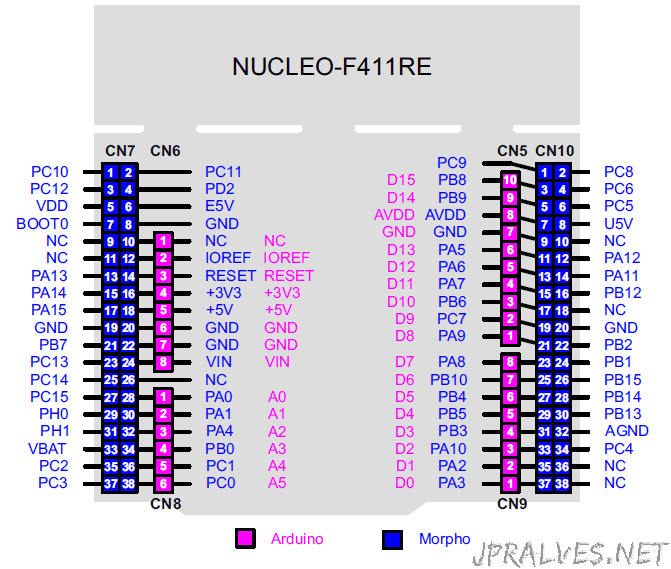

# README
A basic template for Rust projects based on the NUCLEO-F411RE development board featuring the STM32F411RETx

**MAKE SURE TO UPDATE**

Make sure to update `rust-toolchain.toml` to match the version found here: https://github.com/embassy-rs/embassy/blob/main/rust-toolchain.toml

## Getting started

Follow guide here: https://embassy.dev/book/dev/getting_started.html

## Running 

plug in the dev board and just run:
```bash
cargo run
```

## Devboard Pinout
